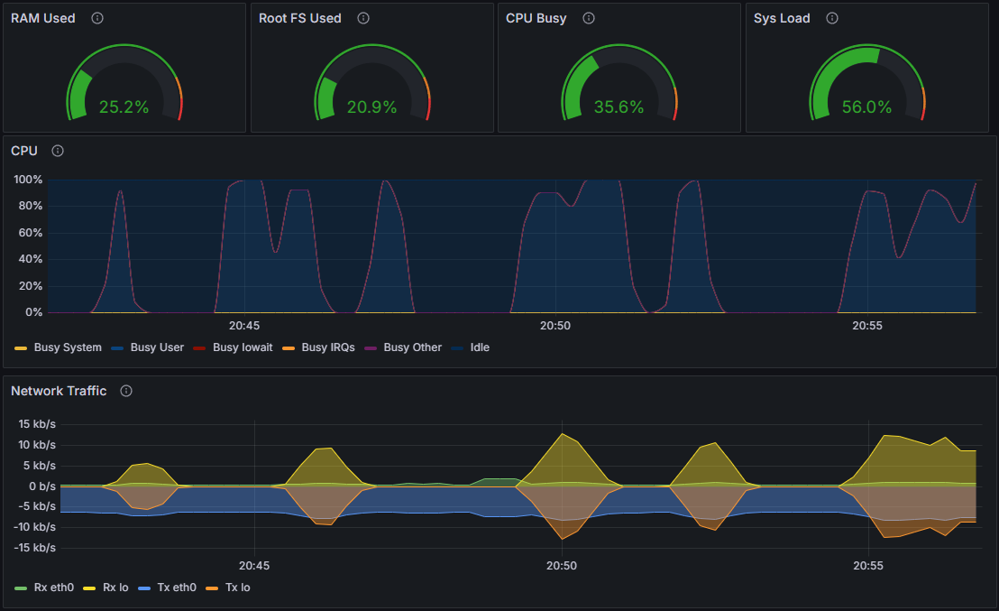

# AWS Prometheus & Grafana Monitoring Dashboard Project

## Project Overview

This repository contains a CloudFormation template and supporting configuration files for deploying a monitoring solution on AWS using Prometheus and Grafana. The project demonstrates the automation of metrics collection, server configuration, and custom dashboard provisioning in a cloud environment. It simulates a real-world scenario where a Prometheus/Grafana server monitors a test application server (running Node Exporter and a custom metrics generator), with dynamic configuration to ensure portability across deployments.

As a personal project to build practical experience, this setup showcases skills in AWS infrastructure as code (IaC), container orchestration with Docker Compose, scripting for dynamic configuration, and integrating open-source monitoring tools. It highlights problem-solving in areas like data source UID management, placeholder resolution, and ensuring dashboards adapt to new environments without manual intervention.

### Key Technologies & Skills Demonstrated
- **Monitoring Stack**: Prometheus for metrics scraping, Grafana for visualization, Node Exporter for host metrics.
- **AWS Services**: CloudFormation for IaC, EC2 instances, Security Groups, SSM Parameter Store for AMI resolution.
- **Automation & Scripting**: Bash user data scripts for EC2 bootstrap, dynamic replacement of placeholders (e.g., IP addresses, data source UIDs), API calls to Grafana for provisioning reloads.
- **Containerization**: Docker and Docker Compose for running Prometheus and Grafana.
- **Custom Features**: A test Python app to simulate CPU usage and HTTP requests, providing verifiable data for the Grafana dashboard.
- **Dynamic Configuration**: Scripts to fetch Grafana data source UIDs post-deployment and inject them into the dashboard JSON, ensuring seamless integration.

### Architecture
- **Prometheus/Grafana Server (EC2 Instance)**: Hosts Prometheus and Grafana in Docker containers. User data script installs Docker, downloads configs from this repo, replaces placeholders, starts containers, and dynamically updates the dashboard with the correct data source UID.
- **App Server (EC2 Instance)**: Runs Node Exporter for metrics exposure and a custom Python script to generate test load for Prometheus to scrape.
- **Security**: Separate security groups for each instance, allowing Prometheus to scrape Node Exporter (port 9100) and public access to Prometheus (9090) and Grafana (3000).
- **Provisioning Flow**:
  1. CloudFormation deploys EC2 instances.
  2. User data scripts configure servers, download files, and start services.
  3. Post-startup script waits for Grafana, fetches Prometheus UID, updates dashboard JSON, copies it to the container, and reloads provisioning.

The template is designed for a single VPC and public subnet, with parameters for customization.

### Deployment
To deploy (tested on AWS):
1. Update parameters (e.g., `VpcId`, `SubnetId`, `GitHubRepoUrl` if forked).
2. Launch the stack via AWS CLI: `aws cloudformation create-stack --stack-name monitoring-stack --template-body file://template.yaml --parameters ParameterKey=VpcId,ParameterValue=<your-vpc-id> ParameterKey=SubnetId,ParameterValue=<your-subnet-id>`.
3. Access Grafana at `http://<ec2-public-hostname>:3000` (default login: admin/admin).
4. Verify metrics in Prometheus (`http://<ec2-public-hostname>:9090/targets`) and the dashboard in Grafana.

## Next Steps

To enhance the project’s alignment with AWS best practices and production readiness, the following improvements are planned:

- **Switch to cfn-init for Configuration Management**: Replace the EC2 user data scripts with cfn-init to provide a more robust and modular way to configure the Prometheus/Grafana and app servers. This will improve maintainability by separating configuration logic from instance bootstrap and enable easier updates to the setup.
- **Host Configuration Files on AWS S3**: Move configuration files from the GitHub repository to an S3 bucket with versioning and access controls. This leverages AWS-native storage, improves security, and reduces external dependencies.
- **Automate Authentication and Security with AWS Secrets Manager**: Replace hardcoded default credentials with AWS Secrets Manager for secure storage and retrieval. Integrate Secrets Manager with cfn-init scripts to dynamically configure authentication, enhancing security for Prometheus and Grafana access.
- **Add Auto Scaling for Resilience**: Introduce an Auto Scaling group for the Prometheus/Grafana EC2 instance to ensure high availability and automatic recovery from instance failures. This will demonstrate scalable architecture design and improve system reliability.
- **Implement CloudWatch Monitoring**: Set up CloudWatch alarms to monitor EC2 instance health and configure SNS notifications for alerts. This will enhance observability and integrate AWS-native monitoring with the Prometheus/Grafana stack.

These enhancements will make the project more robust, secure, and aligned with AWS best practices, preparing it for production-like environments.

## About Me
This project is part of my portfolio to demonstrate hands-on experience with AWS, monitoring tools, and automation. For more details or collaboration, connect with me on LinkedIn or check my other repositories.

- GitHub: [My GitHub Profile](https://github.com/matthew-pm-dev)
- LinkedIn: [My LinkedIn Profile](https://www.linkedin.com/in/matthew-malyk-78679820/)